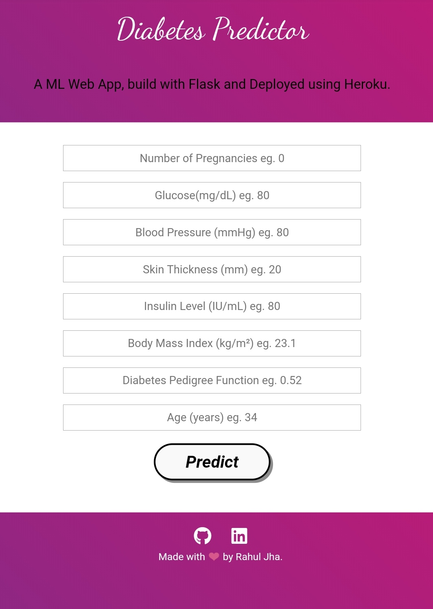

# Diabetes Predictor

In this project, our objective is to predict whether the patient has diabetes or not based on various features like, Pregnancies, Glucose level, BloodPressur, Insulin, Age, BMI. We will perform all the steps from Data gathering to Model deployment. During Model evaluation, we compare various machine learning algorithms on the basis of accuracy_score and find the best one. Then we create a web app using Flask which is a python micro framework.

# Demo

Link:- https://diabetes-prediction-app1.herokuapp.com/

# Overview

This is a classification Flask app trained on top of sklearn. The trained model take features like, Pregnancies, Glucose level, BloodPressur, Insulin, Age, BMI as an input and predict the Diabetes.

# Technical Aspect

This project is divided into two part:

 1. Training a Machine Learning model using sklearn.
 2. Building and hosting a Flask web app on Heroku.
